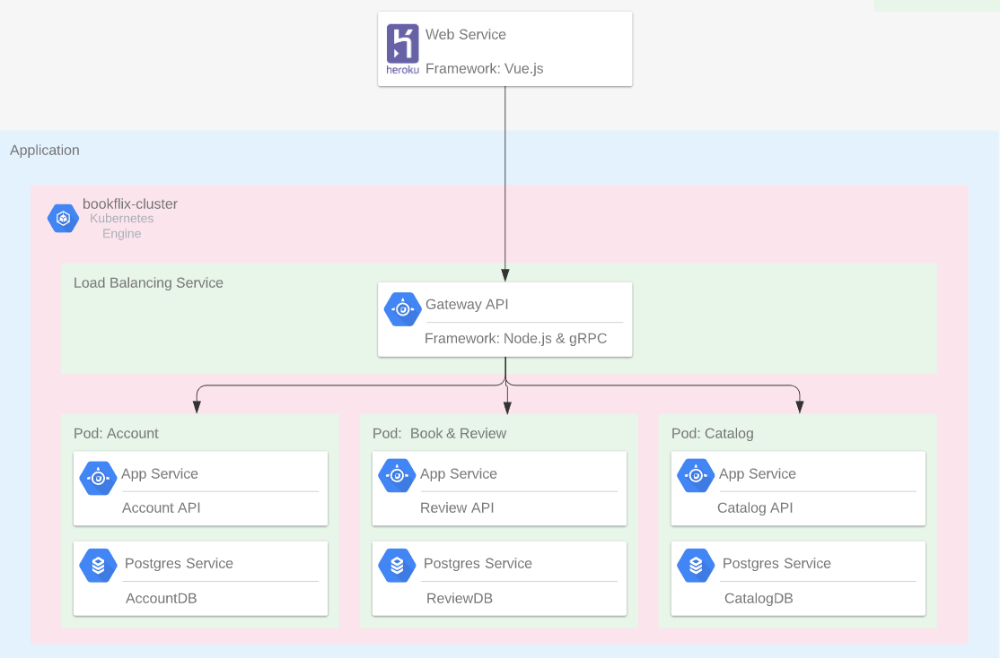
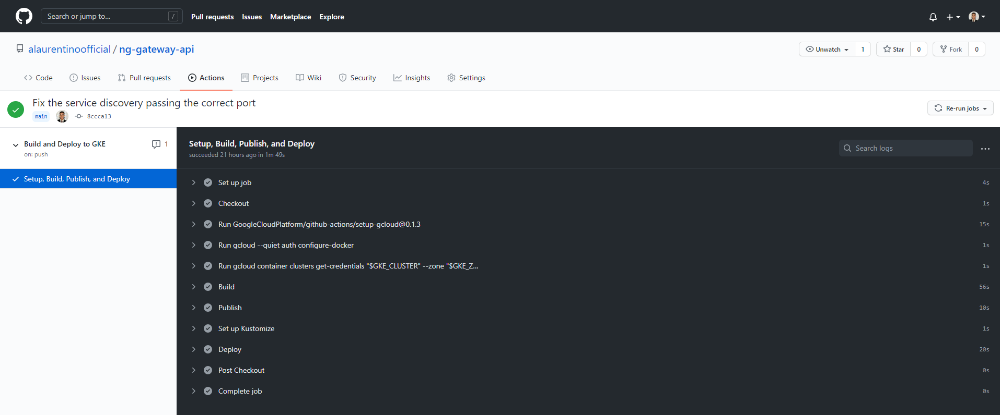

# Bookflix

Acesse o MPV neste [link](https://thebookflix.herokuapp.com/).

Bookflix é um site de resenhas e avaliações de livros. A ideia surgiou logo após um de nossos desenvolvedores mostrar algumas pesquisas, nas quais mostravem a falta do habito de leitura dos cidadões brasileiros. Apartir disso decidimos criar uma plataforma de resenhas de livros e de avaliações para que as pessoas pudessem explorar um universo de novos livros.

 
 

# Infraestrutura

Optamos por criar uma infraestrutura que suportasse o escalonamento para suportar múltiplos acessos simultanêos. Para tal utilizamos uma arquitetura de  micro-serviços no back-end utilizando o kubernetes como orquestrador e um front-end que fosse leve através do vue.js .

#### Cloud provider

O cloud provider utilizado foi o google cloud devido a facilidade de deploy de pods kubernetes através do Google Kubernetes Registry, bem como o repositório de imagens docker com o Google Container Registry.

#### Micro-serviços

- [ng-gateway-api](https://github.com/alaurentinoofficial/bookflix/tree/ng-gateway-api): Intercepta as resquests HTTP e direciona para os micro-serviços através de gRPC. Além de conter validação dos inputs de dados
- [ng-auth-service](https://github.com/alaurentinoofficial/bookflix/tree/ng-auth-service): Gerência a conta e autenticação dos usuários  
- [ng-book-service](https://github.com/alaurentinoofficial/bookflix/tree/ng-book-service): Gerência os livros, categorias e também as resenhas dos usuários
- [ng-catalog-service`](https://github.com/alaurentinoofficial/bookflix/tree/ng-catalog-service): Gerência os catalogos de livros
- [ng-web-service](https://github.com/alaurentinoofficial/bookflix/tree/ng-web-service): Aplicação do usuário final que pode ser acessado em [https://thebookflix.herokuapp.com/](https://thebookflix.herokuapp.com/)

 
 

# CI/CD

Por utilizarmos multiplos serviços, foi necessário a criação de um continous integrations/continous delivery para que a cada nova entrega o deploy seja automátio para produção. Neste caso há um pipeline para cada micro-serviço que já faz o processo de build, de cadastro das imagens no GCR e deploy no GKE.

